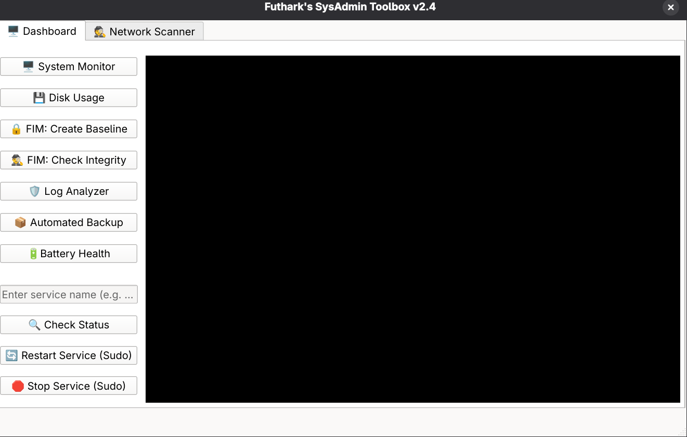
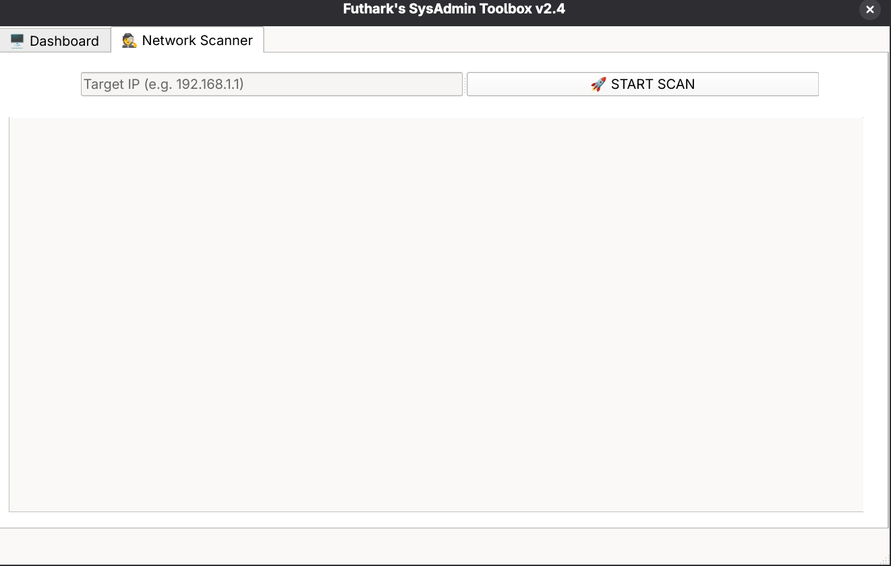

# SysAdmin Toolbox 🛠️ v2.6.1 (Stable)


A powerful system administration tool designed for Linux (Fedora), featuring both a **Classic CLI (Terminal)** and a **Modern GUI (Graphical Interface)**.

> **🎓 Educational Project:** This tool represents my journey from **Bash Scripting** to **Python GUI Development**. It combines system-level commands with a user-friendly interface to perform security audits, monitoring, backups, and **advanced network scanning**.

## 📸 Screenshots

### 1. The Dashboard (System & Services)

*Real-time monitoring, service management, and security logs.*

### 2. Network Scanner (Banner Grabbing & Reporting)

*Multi-threaded port scanner with **PDF Export** capabilities.*

---

## 🚀 What's New in v2.6.1?

### 🔧 Bug Fixes (Hotfix)
* **FIM Logic Fixed:** Resolved the "Error Code 1" issue in the File Integrity Monitor. It now uses the `find` command to gracefully handle missing file extensions during baseline creation.

### 📄 Professional PDF Reporting
* **Export Scan Results:** Right-click on the scan results to save them as a professional PDF report.
* **Auto-Sanitization:** Automatically converts emojis (e.g., ✅, 🚀) into text-safe format (e.g., `[+]`, `>>>`) to ensure compatibility with all PDF readers.

### 🕵️‍♂️ Network & Security
* **Advanced Port Scanner:** Multithreaded scanning preventing UI freeze.
* **Banner Grabbing:** Detects service versions (e.g., `SSH-2.0-OpenSSH_8.7`) running on open ports.
* **Log Analyzer (IDS):** Detects SSH brute-force attacks and Sudo violations.

## 📂 Project Structure

```text
sysadmin-toolbox/
├── src/            # Source Code (Python Logic)
│   └── main_gui.py
├── assets/         # UI Resources
│   └── toolbox.ui
├── screenshots/    # Project Images
├── data/           # Databases & Logs (Generated files)
│   └── fim_baseline.db
├── install.sh      # Desktop Installer
├── uninstall.sh    # Uninstaller
└── toolbox.sh      # CLI Version (Bash Script)
```

## 📋 Requirements

Designed for **Fedora Linux**, but compatible with most systemd-based distributions.

### Core Requirements
* `bash` (4.0+)
* `journalctl` & `systemctl`
* `sha256sum`
* `upower`

### GUI Requirements
* `python3`
* `PyQt6` (Fedora: `sudo dnf install python3-pyqt6`)
* `fpdf2` (For PDF Generation: `pip install fpdf2`)
* `polkit` (For `pkexec` password prompts in GUI)

## 📦 Installation & Usage

Clone the repository:
```bash
git clone [https://github.com/Futhark1393/sysadmin-toolbox.git](https://github.com/Futhark1393/sysadmin-toolbox.git)
cd sysadmin-toolbox
```

---

### 🎨 Option 1: GUI Mode (Recommended)
Add the application to your system menu for easy access.

**Step 1: Install Python Dependencies**
```bash
sudo dnf install python3-pyqt6
pip install fpdf2
```

**Step 2: Run the Installer**
This script creates a dynamic desktop shortcut.
```bash
chmod +x install.sh
./install.sh
```
*🎉 Now simply search for **"SysAdmin Toolbox"** in your Application Menu!*

---

### 🎒 Option 2: Portable Binary (Standalone)
Build a single executable file that runs without Python installed.

**Step 1: Install PyInstaller**
```bash
pip install pyinstaller fpdf2
```

**Step 2: Build the Project**
```bash
pyinstaller --name "SysAdminToolbox" --onefile --windowed --add-data "assets/toolbox.ui:assets" src/main_gui.py
```

**Step 3: Run**
The executable is generated in the `dist/` folder.
```bash
./dist/SysAdminToolbox
```

---

### 🖥️ Option 3: CLI Mode (Terminal)
Best for headless servers or quick SSH access.

**Run:**
```bash
chmod +x toolbox.sh
./toolbox.sh
```

## 🗑️ Uninstallation

To remove the desktop shortcut and clean up generated data:

```bash
chmod +x uninstall.sh
./uninstall.sh
```

## ⚠️ Legal Disclaimer

**For Educational Purposes Only.**
This tool is designed for system administrators and security enthusiasts to audit their *own* networks and systems.

* **Do not use this tool on networks or systems you do not own or do not have explicit permission to test.**
* The author (@Futhark1393) is not responsible for any damage, data loss, or legal consequences caused by the misuse of this tool.
* By downloading and using this software, you agree to use it responsibly and in accordance with all applicable local and international laws.

## 📄 License

This project is open source and available under the [MIT License](LICENSE).
