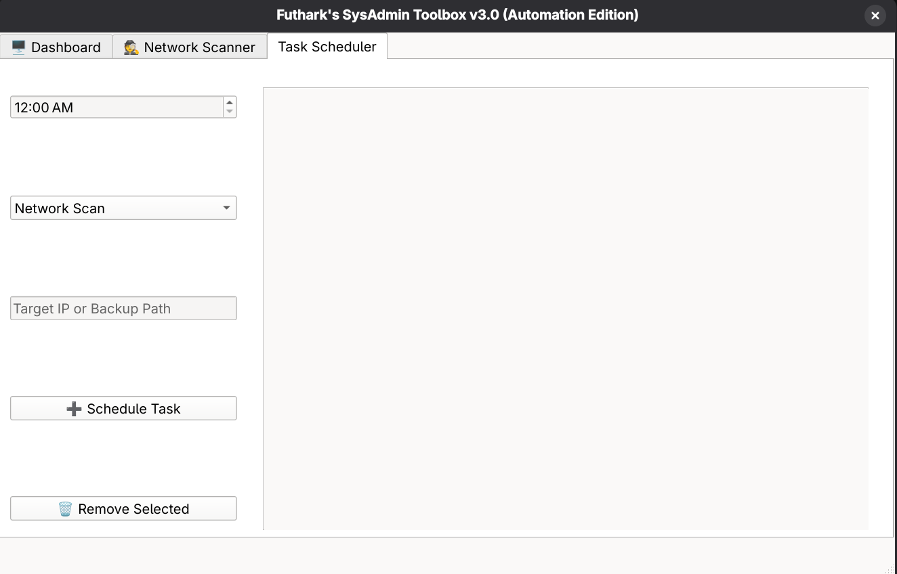

# SysAdmin Toolbox 🛠️ v3.0 (Automation Edition)


A powerful system administration and security suite designed for **Linux (Fedora)**. This tool bridges the gap between manual scripting and modern GUI tools, now featuring **Task Automation** and **Headless Operations**.

> **🎓 Educational Project:** This tool represents my journey from Bash Scripting to Python GUI Development and System Automation. It combines system-level commands, network auditing, and `cron` management into a single interface.

## 📸 Screenshots

### 1. The Dashboard (System & Services)

*Real-time monitoring, service management, and security logs.*

### 2. Network Scanner (Banner Grabbing & PDF Export)

*Multi-threaded port scanner with professional PDF reporting.*

### 3. Task Scheduler (New!)

*Automate scans and backups using the native Linux Cron system.*

---

## 🚀 What's New in v3.0?

### 🤖 Automation & Scheduling
* **Task Scheduler UI:** Easily schedule recurring tasks (Security Scans or Backups) without writing complex Cron syntax manually.
* **Cron Management:** View and delete tasks created by SysAdmin Toolbox directly from the GUI.

### 👻 Headless Mode (CLI Support)
* **Background Scanning:** The tool can now run without the GUI using command-line arguments.
    * Example: `python3 src/main_gui.py --scan 192.168.1.10`
* **Auto-Reporting:** When triggered by the Scheduler, scan results are automatically saved as timestamped text files (`scan_report_IP_DATE.txt`).

### ⚡ Previous Features (v2.6.x)
* **UX Improvements:** Enter key support for quick scanning.
* **PDF Reporting:** Export scan results to PDF.
* **FIM (File Integrity Monitor):** Detect unauthorized file changes.
* **Log Analyzer (IDS):** Detect SSH brute-force and Sudo violations.

## 📂 Project Structure

```text
sysadmin-toolbox/
├── src/            # Source Code (Python Logic)
│   └── main_gui.py
├── assets/         # UI Resources
│   └── toolbox.ui
├── screenshots/    # Project Images
│   ├── dashboard.png
│   ├── scanner.png
│   └── scheduler.png
├── data/           # Databases & Logs
│   └── fim_baseline.db
├── install.sh      # Desktop Installer
├── uninstall.sh    # Uninstaller
└── toolbox.sh      # Legacy CLI Version
```

## 📋 Requirements

Designed for **Fedora Linux**, but compatible with most systemd-based distributions.

### Core Requirements
* `python3`
* `PyQt6` (Fedora: `sudo dnf install python3-pyqt6`)
* `fpdf2` (For PDF Generation: `pip install fpdf2`)
* `cronie` (For Scheduling: Ensure `crond` service is running)
* `polkit` (For `pkexec` password prompts)

## 📦 Installation & Usage

Clone the repository:
```bash
git clone [https://github.com/Futhark1393/sysadmin-toolbox.git](https://github.com/Futhark1393/sysadmin-toolbox.git)
cd sysadmin-toolbox
```

---

### 🎨 GUI Mode (Recommended)
**Step 1: Install Dependencies**
```bash
sudo dnf install python3-pyqt6
pip install fpdf2
```

**Step 2: Install & Run**
```bash
chmod +x install.sh
./install.sh
```
*🎉 Search for **"SysAdmin Toolbox"** in your App Menu!*

---

### 🤖 Automation Mode (How it works)
You can schedule tasks via the **"Task Scheduler"** tab in the GUI.

**To run a scan manually in Headless Mode (No GUI):**
```bash
# This command will scan the IP and save a report to the current directory
python3 src/main_gui.py --scan 192.168.1.1
```
*Useful for servers or remote execution via SSH.*

---

### 🎒 Portable Binary
Build a standalone executable (no Python required):

```bash
pip install pyinstaller fpdf2
pyinstaller --name "SysAdminToolbox" --onefile --windowed --add-data "assets/toolbox.ui:assets" src/main_gui.py
./dist/SysAdminToolbox
```

## ⚠️ Legal Disclaimer

**For Educational Purposes Only.**
This tool is designed for system administrators to audit their **own** networks and systems.
* **Do not use this tool on networks you do not own.**
* The author (@Futhark1393) is not responsible for any misuse.

## 📄 License

This project is open source and available under the [MIT License](LICENSE).
